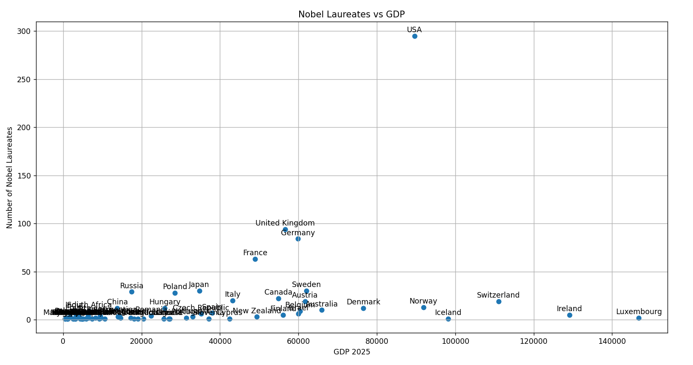
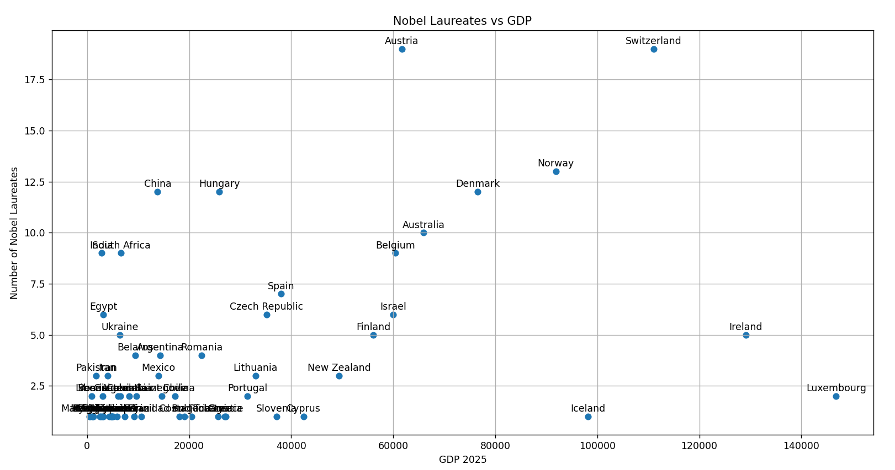

Repository that contains a more advanced Data Engineering project.

ARCHITECTURE

DATA SOURCES  
The project nobel_prize_gdp_db is a data warehouse performed with dbt-duckdb. It contains the REST_API data ingestion from different sources and transformations with DBT:
1. source: International Monetary Fund (IMF) to obtain the GDP information per country (one record per country)
2. source: Nobel Prize website to obtain the Nobel Prize winners and the country where they reside (0, 1 or Many records per country)

Both data sources are joined by using the country column.

DATA MODELING  
The folder model contains several folders by following a medallion architecture (bronze, silver, gold):
- Bronze: tables obtained from the REST_API data ingestion by using python scripts (located in dag_duckdb_scheduler.assets.py)

- Silver: basic transformations (e.g. surrogate keys)

- Gold: joined data. A python plot is performed by using the table gld_laureate_gdp.

- Working layer: some countries do not have the same format in both data sources. Some countries are corrected here by taking the data from the folder SEEDS if such record exists. This gives the power to override/standarize the country codes with the country names.
If necessary, discrepancies in the source can be seen in the view gld_country_discrepancy_source. On the other hand, discrepancies after corrections in theh Working Layer can be seen in the view gld_country_discrepancy_after_correction. 

ORCHESTRATION  
The folder dag_duckdb_scheduler has been created thanks to dagster which is used as an scheduler. Library used is dagster-dbt.

The file dev.duckdb is the database itself that contains the data already loaded.

FINAL PLOT  
Apparently there is no correlation between the country GDP and the amount of nobel laureates living in those countries. USA, France, Germany do not have the largest GDP, but they have a large amount of laureates.

However, if we filter out those countries with a large number of laureates, then I can see an upwards trend. It seems that there might be a correlation after all.
